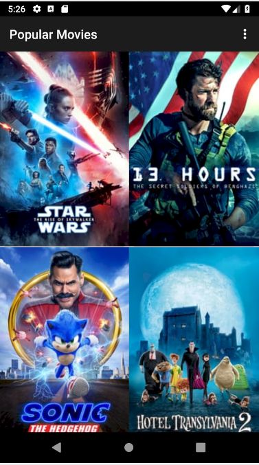
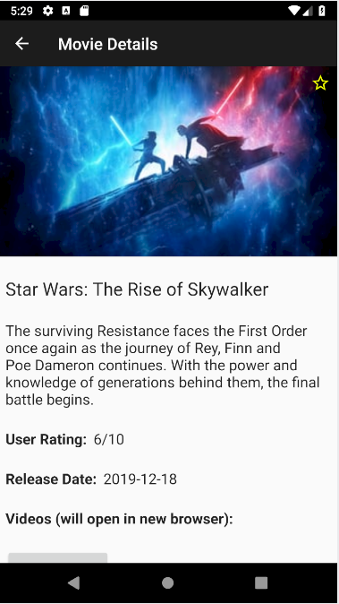

# Popular Movies
View movies sorted by most popular, highest rated, or the user's favorites.

## Installation
To run the app, you must make an account and request your personal API key from The Movie DB.

Main website is: https://www.themoviedb.org/movie?language=en-US

Instructions are at: https://developers.themoviedb.org/3/getting-started/introduction

Once you have a key, create a class called ApiKey with your key accessed by a static method `getApiKey()`.

For example, you can copy-paste the following file into the "utilities" package:
```
package com.example.android.popularmovies.utilities;

public class ApiKey {
    private final static String API_KEY = "YOUR_API_KEY";

    public static String getApiKey()
    {
        return API_KEY;
    }
}
```

## Features:
- Fetches data from the Internet with The Movie DB API
- Presents user with a grid arrangement of movie posters upon launch
- Allows the user to change sort order by most popular or highest-rated
- Allows the user to view and add movies to a favorites collection
- Allows the user to tap on a movie poster and transition to a details screen with additional information such as:
  - title
  - movie backdrop image
  - a plot synopsis
  - user rating
  - release date

## Screenshots


